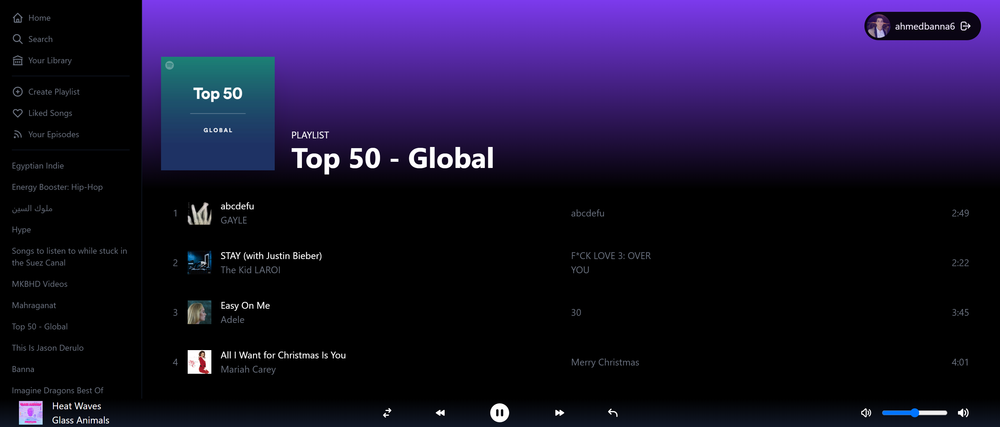

<h1 align="center"> Spotify Clone </h1>

<h3 align="center">Spotify clone built with Next.js and TailwindCSS for learning and practicing purposes.</h3>

### Demo

Make sure you have a real spotify account up and running
[Spotify Clone](https://spotify-clone-kappa-two.vercel.app/login)

### Prerequisite :hammer_and_wrench:

Make sure you have these installed

- [Node.js](https://nodejs.org/en/)
- [git](https://git-scm.com/)

### Instruction :gear:

1. Clone this repository into your local machine using the terminal (mac) or Gitbash (PC) `git clone https://github.com/ahmdabdelsamea/spotify-clone.git`
2. CD to the folder `cd spotify-clone`
3. Run `npm install` to install the project dependencies
4. Get your spotify keys from [Spotify Developer](https://developer.spotify.com/dashboard/login)
5. Create a .env file like the provided example.env and fill it with your keys
6. Run `npm run dev` to run the project at http://localhost:3000

### Technologies :rocket:

- [React](https://reactjs.org/)
- [Next.js](https://nextjs.org/)
- [NextAuth.js](https://next-auth.js.org/)
- [Spotify-API](https://developer.spotify.com/)
- [spotify-web-api-node](https://github.com/thelinmichael/spotify-web-api-node)
- [Recoil](https://recoiljs.org/)
- [Lodash](https://lodash.com/)
- [tailwindcss](https://tailwindcss.com/)
- [heroicons](https://heroicons.com/)
- [Vercel](https://vercel.com/)

> Made with :heart: by Ahmed Abdelsamea _aka BNA_
